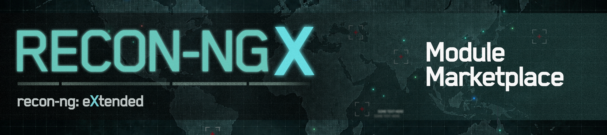

Welcome to the **Recon-NGX Module Marketplace**.

This is the official module repository for the Recon-NGX Framework, which is
based off the [recon-ng](https://github.com/lanmaster53/recon-ng) framework developed by Tim Tomes.

> The modules within this repository are intended for use with the Recon-NGX framework, which 
> can be found [Here](https://github.com/xvzfopt/recon-ngx)

## :loudspeaker: Current Status
This section shows the current module status. It will be updated as more recon-ng 
modules are refactored to be compatible with Recon-NGX
> Functional Modules: **3/109**

## :computer: Information for Developers

Recon-NGX does not yet have an official guide for Module developers. This is primarily because the base 
module and related SDK are under active development. In the meantime, the original Recon-ng guides are
still the best resource:

- [Recon-ng Development Guide](https://github.com/lanmaster53/recon-ng/wiki/Development-Guide) 
- [Recon-ng Wiki](https://github.com/lanmaster53/recon-ng/wiki)

## :warning: Relationship to recon-ng
While Recon-NGX builds upon the ideas and code of recon-ng, it is an independent
community-driven project and is not endorsed by, affiliated with, or officially connected to Tim
Tomes or the original project.

The history and contributions of recon-ng and its marketplace have been preserved to ensure proper 
credit is given to those who contributed to the original project.

### Original Project Links
 - [Recon-ng](https://github.com/lanmaster53/recon-ng)
 - [Recon-ng-marketplace](https://github.com/lanmaster53/recon-ng-marketplace)
